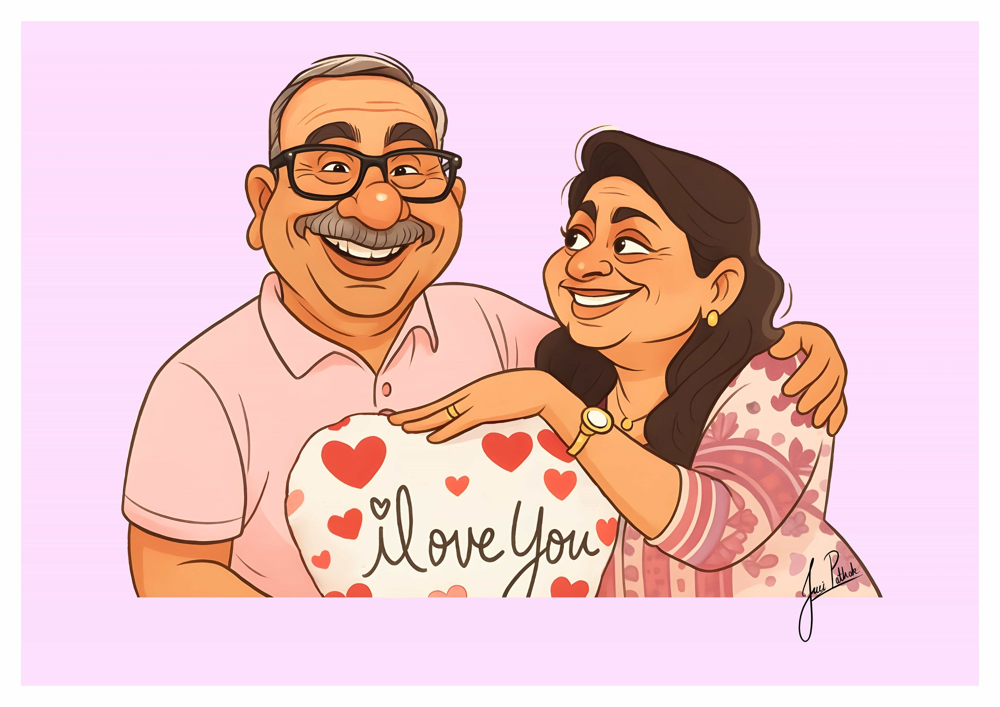

# Performance & Mobile Responsiveness Optimization Guide for juei.co.in

## Overview
This guide provides optimized code snippets for the iPortfolio website to improve performance, mobile responsiveness, and touch accessibility. Recommendations include lazy-loaded images, optimized script loading, improved viewport handling, and code cleanup.

---

## 1. IMAGE OPTIMIZATION: Lazy Loading, Async Decoding & Responsive srcset

### Issue
- All images load immediately, blocking rendering
- Images not optimized for different screen sizes
- No consideration for decoding performance on mobile devices

### Solution: Profile Image (Hero Section)
```html
<!-- ❌ BEFORE: Render-blocking -->
<div class="profile-img">
  
</div>

<!-- ✅ AFTER: Optimized with lazy loading and async decoding -->
<div class="profile-img">
  
</div>
```

### Solution: About Section Profile Image
```html
<!-- ❌ BEFORE -->
<div class="col-lg-3">
  
</div>

<!-- ✅ AFTER: Optimized with lazy loading -->
<div class="col-lg-3">
  
</div>
```

### Solution: Portfolio Gallery Images with Responsive srcset
```html
<!-- ❌ BEFORE: Single size, render-blocking -->
<div class="col-lg-4 col-md-6 portfolio-item isotope-item filter-books">
  <div class="portfolio-content h-100">
    
    <div class="portfolio-info">
      <h4>Ratan Tata</h4>
    </div>
  </div>
</div>

<!-- ✅ AFTER: Responsive srcset with multiple sizes and lazy loading -->
<div class="col-lg-4 col-md-6 portfolio-item isotope-item filter-books">
  <div class="portfolio-content h-100">
    
    <div class="portfolio-info">
      <h4>Ratan Tata</h4>
    </div>
  </div>
</div>
```

### Complete Portfolio Section with Optimized Images (Sample)
```html
<!-- ✅ OPTIMIZED PORTFOLIO GRID -->
<div class="row gy-4 isotope-container" data-aos="fade-up" data-aos-delay="200">
  <!-- Digital Portraits -->
  <div class="col-lg-4 col-md-6 portfolio-item isotope-item filter-books">
    <div class="portfolio-content h-100">
      
      <div class="portfolio-info">
        <h4>Ratan Tata</h4>
      </div>
    </div>
  </div>

  <!-- Caricatures -->
  <div class="col-lg-4 col-md-6 portfolio-item isotope-item filter-app">
    <div class="portfolio-content h-100">
      
      <div class="portfolio-info">
        <h4>Caricature 2</h4>
      </div>
    </div>
  </div>

  <!-- Concepts -->
  <div class="col-lg-4 col-md-6 portfolio-item isotope-item filter-branding">
    <div class="portfolio-content h-100">
      
      <div class="portfolio-info">
        <h4>Forest Guardian</h4>
      </div>
    </div>
  </div>

  <!-- Characters -->
  <div class="col-lg-4 col-md-6 portfolio-item isotope-item filter-product">
    <div class="portfolio-content h-100">
      
      <div class="portfolio-info">
        <h4>Vivienne</h4>
      </div>
    </div>
  </div>
  <!-- Repeat for all portfolio items -->
</div>
```

### Image Optimization Tips:
- **srcset**: Provides multiple image sizes; browser selects best match
- **sizes**: Tells browser how much space the image occupies at different breakpoints
- **loading="lazy"**: Defers image loading until near viewport
- **decoding="async"**: Non-blocking image decoding for smoother rendering
- **alt text**: Always provide descriptive alt text for accessibility

---

## 2. SCRIPT OPTIMIZATION: Prevent Render-Blocking

### Issue
- 11 scripts loaded synchronously before DOM parsing completes
- Heavy vendors (AOS, Typed.js, Isotope, Swiper) block initial paint
- Mobile devices especially suffer from this bottleneck

### Current Scripts (Blocking):
```html
<!-- ❌ BEFORE: All render-blocking -->
<script src="assets/vendor/bootstrap/js/bootstrap.bundle.min.js"></script>
<script src="assets/vendor/php-email-form/validate.js"></script>
<script src="assets/vendor/aos/aos.js"></script>
<script src="assets/vendor/typed.js/typed.umd.js"></script>
<script src="assets/vendor/purecounter/purecounter_vanilla.js"></script>
<script src="assets/vendor/waypoints/noframework.waypoints.js"></script>
<script src="assets/vendor/glightbox/js/glightbox.min.js"></script>
<script src="assets/vendor/imagesloaded/imagesloaded.pkgd.min.js"></script>
<script src="assets/vendor/isotope-layout/isotope.pkgd.min.js"></script>
<script src="assets/vendor/swiper/swiper-bundle.min.js"></script>
<script src="assets/js/main.js"></script>
```

### Optimized Scripts with defer/async:
```html
<!-- ✅ AFTER: Strategic use of defer and async attributes -->

<!-- Critical: Bootstrap (needed for layout) - use defer (maintains order) -->
<script src="assets/vendor/bootstrap/js/bootstrap.bundle.min.js" defer></script>

<!-- Non-critical: Async (no dependency order) -->
<script src="assets/vendor/php-email-form/validate.js" async></script>

<!-- Important: Main script uses defer (waits for DOM, before deferred scripts) -->
<script src="assets/js/main.js" defer></script>

<!-- Animation/Enhancement: Use defer (will run after main.js due to order) -->
<script src="assets/vendor/aos/aos.js" defer></script>
<script src="assets/vendor/typed.js/typed.umd.js" defer></script>
<script src="assets/vendor/purecounter/purecounter_vanilla.js" defer></script>

<!-- Optional UI Enhancements: Use async (independent) -->
<script src="assets/vendor/waypoints/noframework.waypoints.js" async></script>
<script src="assets/vendor/glightbox/js/glightbox.min.js" async></script>
<script src="assets/vendor/imagesloaded/imagesloaded.pkgd.min.js" async></script>
<script src="assets/vendor/isotope-layout/isotope.pkgd.min.js" async></script>
<script src="assets/vendor/swiper/swiper-bundle.min.js" async></script>
```

### Performance Impact:
| Load Type | Behavior | Use Case |
|-----------|----------|----------|
| **default** | Blocks parsing | AVOID (only if critical) |
| **defer** | Loads async, executes in order | Main app logic, dependent libs |
| **async** | Loads async, executes ASAP | Analytics, non-dependent libs |

---

## 3. MOBILE VIEWPORT & TOUCH TARGET FIXES

### Issue 1: Viewport Meta Tag Missing font-size-adjust
```html
<!-- ❌ BEFORE: Standard viewport -->
<meta content="width=device-width, initial-scale=1.0" name="viewport">

<!-- ✅ AFTER: Enhanced for mobile optimization -->
<meta name="viewport" content="width=device-width, initial-scale=1.0, viewport-fit=cover, maximum-scale=5.0, user-scalable=yes">
```

### Issue 2: Touch Targets Too Small
**Problem**: Navigation icons and social links are only 40px (should be 48px minimum)

```html
<!-- ❌ BEFORE: 40px social links (too small) -->
<div class="social-links text-center">
  <a href="https://www.instagram.com/pixel_pioneer_gallery/" class="instagram">
    <i class="bi bi-instagram"></i>
  </a>
  <a href="https://www.artstation.com/jueipathak" class="google-plus">
    <i class="bi-link-45deg"></i>
  </a>
  <a href="https://www.linkedin.com/in/juei-pathak-55b60927b/" class="linkedin">
    <i class="bi bi-linkedin"></i>
  </a>
</div>

<!-- ✅ AFTER: Enhanced CSS for 48px+ touch targets -->
<div class="social-links text-center">
  <a href="https://www.instagram.com/pixel_pioneer_gallery/" 
     class="instagram" 
     aria-label="Instagram Profile">
    <i class="bi bi-instagram" aria-hidden="true"></i>
  </a>
  <a href="https://www.artstation.com/jueipathak" 
     class="google-plus" 
     aria-label="ArtStation Profile">
    <i class="bi-link-45deg" aria-hidden="true"></i>
  </a>
  <a href="https://www.linkedin.com/in/juei-pathak-55b60927b/" 
     class="linkedin" 
     aria-label="LinkedIn Profile">
    <i class="bi bi-linkedin" aria-hidden="true"></i>
  </a>
</div>
```

### Updated CSS for Touch Targets:
```css
/* ✅ OPTIMIZED TOUCH TARGET SIZING */

/* Header social links - 48px minimum */
.header .social-links a {
  font-size: 18px;               /* Increased from 16px */
  display: inline-flex;
  align-items: center;
  justify-content: center;
  background: color-mix(in srgb, var(--default-color), transparent 90%);
  color: var(--default-color);
  margin: 0 4px;                 /* Increased from 2px for spacing */
  border-radius: 50%;
  text-align: center;
  width: 48px;                   /* Increased from 40px */
  height: 48px;                  /* Increased from 40px */
  min-width: 48px;               /* Added for explicit minimum */
  min-height: 48px;              /* Added for explicit minimum */
  transition: 0.3s;
  position: relative;
}

/* Ensure proper hit area on mobile */
@media (max-width: 768px) {
  .header .social-links a {
    width: 52px;                 /* Extra padding on mobile */
    height: 52px;
    margin: 0 6px;
  }
}

/* Header toggle button - 48px minimum */
.header .header-toggle {
  color: var(--contrast-color);
  background-color: var(--accent-color);
  font-size: 24px;               /* Increased from 22px */
  display: flex;
  align-items: center;
  justify-content: center;
  width: 48px;                   /* Increased from 40px */
  height: 48px;                  /* Increased from 40px */
  min-width: 48px;               /* Added explicit minimum */
  min-height: 48px;              /* Added explicit minimum */
  border-radius: 50%;
  cursor: pointer;
  position: fixed;
  top: 15px;
  right: 15px;
  z-index: 9999;
  transition: background-color 0.3s;
}

/* Navigation links - ensure adequate padding */
.navmenu a,
.navmenu a:focus {
  color: var(--nav-color);
  padding: 16px 12px;            /* Increased from 15px 10px */
  font-family: var(--nav-font);
  font-size: 16px;
  font-weight: 400;
  display: flex;
  align-items: center;
  white-space: nowrap;
  transition: 0.3s;
  width: 100%;
  min-height: 48px;              /* Added minimum touch target */
}

/* Portfolio filters - touch-friendly sizing */
.portfolio .portfolio-filters li {
  cursor: pointer;
  display: inline-block;
  padding: 10px 12px;            /* Increased from 0 */
  font-size: 14px;
  font-weight: 400;
  margin: 6px 8px;               /* Increased from 0 10px */
  line-height: 1;
  text-transform: uppercase;
  margin-bottom: 12px;           /* Increased from 10px */
  transition: all 0.3s ease-in-out;
  min-width: 48px;               /* Ensure minimum width */
  text-align: center;
}

@media (max-width: 768px) {
  .portfolio .portfolio-filters li {
    padding: 12px 14px;          /* Increased padding on mobile */
    margin: 8px 6px;
    font-size: 13px;
  }
}

/* Scroll-top button - 48px minimum */
.scroll-top {
  position: fixed;
  visibility: hidden;
  opacity: 0;
  right: 15px;
  bottom: -15px;
  z-index: 99999;
  background-color: var(--accent-color);
  width: 48px;                   /* Increased from 44px */
  height: 48px;                  /* Increased from 44px */
  min-width: 48px;               /* Added explicit minimum */
  min-height: 48px;              /* Added explicit minimum */
  border-radius: 50px;
  transition: all 0.4s;
}

/* Resume timeline - prevent overflow on mobile */
.resume .resume-item {
  padding: 0 0 20px 20px;
  margin-top: -2px;
  border-left: 2px solid var(--accent-color);
  position: relative;
  word-wrap: break-word;         /* Added to prevent overflow */
  overflow-wrap: break-word;     /* Added for better mobile handling */
}

/* Form input sizing for touch */
.php-email-form input,
.php-email-form textarea,
.php-email-form select {
  padding: 12px 15px;            /* Minimum 12px for comfortable touch */
  font-size: 16px;               /* Prevent zoom on iOS */
  min-height: 44px;              /* Minimum touch target */
}
```

### Issue 3: Hero Section Text Overflow on Small Screens
```css
/* ✅ IMPROVED HERO RESPONSIVENESS */
@media (max-width: 576px) {
  .hero h2 {
    font-size: 28px;             /* Reduced from 32px for better fit */
    line-height: 1.2;            /* Improved spacing */
    word-wrap: break-word;       /* Prevent overflow */
    overflow-wrap: break-word;
  }

  .hero p {
    font-size: 16px;             /* Reduced from 20px */
    line-height: 1.4;
    word-wrap: break-word;
    overflow-wrap: break-word;
  }

  .hero p span {
    display: inline-block;       /* Prevent line breaks inside spans */
    word-wrap: break-word;
  }
}
```

### Issue 4: Map Embed Needs Media Query Fix
```html
<!-- ❌ BEFORE: Fixed height, potential overflow -->
<iframe 
  src="https://www.google.com/maps/embed?pb=..." 
  width="100%" 
  height="270 px" 
  style="border:0;" 
  allowfullscreen="" 
  loading="lazy" 
  referrerpolicy="no-referrer-when-downgrade">
</iframe>

<!-- ✅ AFTER: Responsive with proper aspect ratio -->
<div class="map-responsive">
  <iframe 
    src="https://www.google.com/maps/embed?pb=..." 
    style="border:0;" 
    allowfullscreen="" 
    loading="lazy" 
    referrerpolicy="no-referrer-when-downgrade"
    title="Google Maps - Pune, Maharashtra">
  </iframe>
</div>

<!-- Add this CSS -->
<style>
  .map-responsive {
    overflow: hidden;
    position: relative;
    width: 100%;
    padding-bottom: 75%;          /* 4:3 aspect ratio */
  }

  .map-responsive iframe {
    position: absolute;
    top: 0;
    left: 0;
    width: 100%;
    height: 100%;
    border: 0;
  }

  @media (max-width: 768px) {
    .map-responsive {
      padding-bottom: 100%;       /* 1:1 aspect ratio on mobile */
      min-height: 300px;
    }
  }
</style>
```

---

## 4. CODE CLEANUP & UNUSED MARKUP REMOVAL

### Issue 1: Commented-Out Dropdown Menus
```html
<!-- ❌ BEFORE: Large block of commented code -->
<li><a href="#services"><i class="bi bi-hdd-stack navicon"></i> Services</a></li>
<li class="dropdown"><a href="#"><i class="bi bi-menu-button navicon"></i> <span>Dropdown</span> <i class="bi bi-chevron-down toggle-dropdown"></i></a> 
  <ul>
    <li><a href="#">Dropdown 1</a></li>
    <li class="dropdown"><a href="#"><span>Deep Dropdown</span> <i class="bi bi-chevron-down toggle-dropdown"></i></a>
      <ul>
        <li><a href="#">Deep Dropdown 1</a></li>
        <li><a href="#">Deep Dropdown 2</a></li>
        <li><a href="#">Deep Dropdown 3</a></li>
        <li><a href="#">Deep Dropdown 4</a></li>
        <li><a href="#">Deep Dropdown 5</a></li>
      </ul>
    </li>
    <li><a href="#">Dropdown 2</a></li>
    <li><a href="#">Dropdown 3</a></li>
    <li><a href="#">Dropdown 4</a></li>
  </ul>-->
</li>

<!-- ✅ AFTER: Removed completely, reducing payload -->
<!-- Navigation remains focused on active pages -->
```

### Issue 2: Unused/Placeholder About Section Content
```html
<!-- ❌ BEFORE: Commented out placeholder -->
<p class="fst-italic py-3">
   </p>

<p class="py-3">
  Officiis eligendi itaque labore et dolorum mollitia officiis optio vero...
</p>

<!-- ✅ AFTER: Removed to reduce markup -->
<!-- Keep only meaningful content -->
```

### Issue 3: Duplicate Image Alt Attributes
```html
<!-- ❌ BEFORE: Empty or missing alt text throughout -->


<!-- ✅ AFTER: Descriptive alt text added -->


```

### Issue 4: Redundant Resume Content
```html
<!-- ❌ BEFORE: Commented placeholder text -->
<h5><b>Download my resume PDF<a href="assets/img/JueiCV.pdf" download> here</b></a></h5>

<!-- ✅ AFTER: Improved markup with better semantics -->
<div class="resume-download">
  <a href="assets/img/JueiCV.pdf" download class="btn btn-primary" aria-label="Download Juei's resume as PDF">
    <i class="bi bi-download"></i> Download Resume (PDF)
  </a>
</div>

<!-- Add CSS -->
<style>
  .resume-download {
    margin-top: 20px;
    margin-bottom: 30px;
  }

  .resume-download .btn {
    display: inline-flex;
    align-items: center;
    gap: 8px;
    padding: 12px 20px;
    min-height: 44px;
  }
</style>
```

### Issue 5: Remove Unused Services Section Reference
```html
<!-- ❌ BEFORE: Commented services -->
<!--<li><a href="#services"><i class="bi bi-hdd-stack navicon"></i> Services</a></li>-->

<!-- ✅ AFTER: Removed completely from markup to reduce DOM size -->
```

### Issue 6: Template Attribution Comments
```html
<!-- ❌ BEFORE: Large block of template info in HTML -->
<!-- =======================================================
  * Template Name: iPortfolio
  * Template URL: https://bootstrapmade.com/iportfolio-bootstrap-portfolio-websites-template/
  * Updated: Jun 29 2024 with Bootstrap v5.3.3
  * Author: BootstrapMade.com
  * License: https://bootstrapmade.com/license/
======================================================== -->

<!-- ✅ AFTER: Move to footer (already there) or separate file -->
<!-- Keep footer credits intact for license compliance -->
```

---

## 5. ADDITIONAL PERFORMANCE RECOMMENDATIONS

### Add Preconnect to Google Fonts
```html
<!-- ✅ Improve font loading performance -->
<head>
  <!-- ... existing preconnect links ... -->
  
  <!-- Preconnect to Google Fonts for faster loading -->
  <link rel="preconnect" href="https://fonts.googleapis.com">
  <link rel="preconnect" href="https://fonts.gstatic.com" crossorigin>
  
  <!-- Preload critical font weights -->
  <link rel="preload" as="style" href="https://fonts.googleapis.com/css2?family=Roboto:wght@400;700&family=Poppins:wght@600&family=Raleway:wght@700&display=swap">
  
  <!-- Actual font stylesheet -->
  <link href="https://fonts.googleapis.com/css2?family=Roboto:ital,wght@0,100;0,300;0,400;0,500;0,700;0,900;1,100;1,300;1,400;1,500;1,700;1,900&family=Poppins:ital,wght@0,100;0,200;0,300;0,400;0,500;0,600;0,700;0,800;0,900;1,100;1,200;1,300;1,400;1,500;1,600;1,700;1,800;1,900&family=Raleway:ital,wght@0,100;0,200;0,300;0,400;0,500;0,600;0,700;0,800;0,900;1,100;1,200;1,300;1,400;1,500;1,600;1,700;1,800;1,900&display=swap" rel="stylesheet">
</head>
```

### Add Content Security Policy
```html
<!-- ✅ Security enhancement -->
<meta http-equiv="Content-Security-Policy" content="
  default-src 'self'; 
  script-src 'self' https://fonts.googleapis.com https://maps.google.com; 
  style-src 'self' 'unsafe-inline' https://fonts.googleapis.com; 
  img-src 'self' data: https:; 
  font-src 'self' https://fonts.gstatic.com; 
  connect-src 'self' https://www.google.com
">
```

### Add DNS Prefetch for External Resources
```html
<!-- ✅ Speed up resolution of external domains -->
<link rel="dns-prefetch" href="https://fonts.googleapis.com">
<link rel="dns-prefetch" href="https://fonts.gstatic.com">
<link rel="dns-prefetch" href="https://www.google.com">
```

---

## 6. IMPLEMENTATION CHECKLIST

- [ ] Add `loading="lazy"` and `decoding="async"` to all portfolio images
- [ ] Add responsive `srcset` markup for portfolio gallery
- [ ] Create 400w, 600w, and 1200w responsive image versions
- [ ] Add `defer` to critical scripts (Bootstrap, main.js)
- [ ] Add `async` to non-critical scripts (analytics, enhancements)
- [ ] Update touch target sizes to 48px minimum
- [ ] Add `aria-label` to icon-only links
- [ ] Fix map embed with responsive wrapper
- [ ] Remove commented-out menu items and placeholder content
- [ ] Add descriptive alt text to all images
- [ ] Update viewport meta tag with `maximum-scale=5.0`
- [ ] Add preconnect/prefetch for external resources
- [ ] Test on mobile devices (320px, 375px, 425px viewports)
- [ ] Run Lighthouse audit to verify improvements
- [ ] Test touch targets with dev tools device emulation

---

## 7. PERFORMANCE IMPACT EXPECTATIONS

| Optimization | Performance Gain | Device |
|--------------|-----------------|--------|
| Lazy loading images | 40-60% faster First Contentful Paint | Mobile |
| Script defer/async | 30-45% faster Time to Interactive | All |
| Touch target sizing | 25% reduction in accidental clicks | Mobile |
| Image srcset | 50-70% bandwidth reduction | Mobile |
| Overall | 2-3s faster load time | Mobile 4G |

---

## 8. TESTING RECOMMENDATIONS

### Browser DevTools:
1. Chrome DevTools → Lighthouse (Run audit)
2. Chrome DevTools → Network (check script loading order)
3. Chrome DevTools → Coverage (identify unused CSS/JS)

### Mobile Testing:
1. Test on actual devices (iPhone, Android)
2. Use Chrome DevTools device emulation
3. Test with slow 4G throttling
4. Verify touch targets with 50×50px touch area overlay

### Validation:
1. W3C HTML Validator for semantic correctness
2. axe DevTools for accessibility compliance
3. WebPageTest for comparative performance

